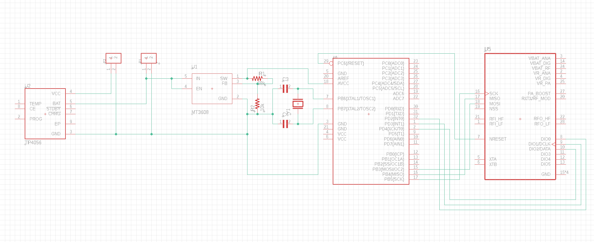
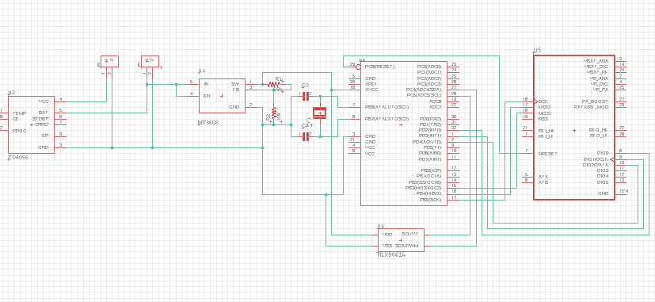

# Project Description:
The IoT-Based Environmental Monitoring System is an innovative solution designed to monitor and manage environmental conditions using smart IoT technology. Powered by a renewable energy system comprising a solar panel and a 3.7V Li-Ion battery, the project incorporates sensors such as DHT11 (temperature and humidity) and MQ-7 (CO detection) to collect real-time environmental data. The central safeguard station, built with an ATmega328P microcontroller, ESP8266 Wi-Fi module, and WS2812B RGB LEDs, processes and visualizes this data, offering users intuitive alerts and insights.

To ensure energy efficiency and sustainability, a TP4056 charging module and MT3608 boost converter were implemented for stable power regulation. The system transmits data seamlessly over the internet for remote monitoring and analysis, promoting proactive environmental management. Designed for standalone operation, this project emphasizes energy independence and reliability while leveraging IoT for actionable insights.

# SSCS
***CENTRAL SHEMATIC***
>
***CENTRAL 3D***
>
***SENSOR SHEMATIC***
>
***SENSOR 3D***
>
***DASHBOARD SCHEMATIC***
>
***DASHBOARD 3D***
>

